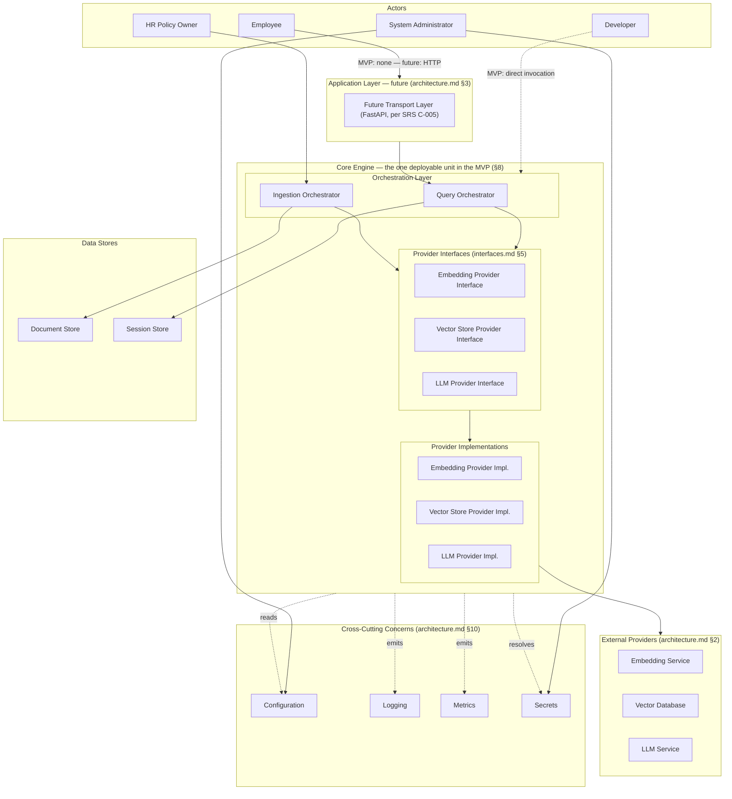

# Deployment Architecture Specification

## Enterprise HR Policy Assistant — How the System Is Deployed and Operated

| Field | Value |
|---|---|
| Document Type | Deployment Architecture Specification |
| Project Name | Enterprise HR Policy Assistant |
| Version | 1.0 |
| Status | Draft — Pending Review |
| Purpose | Define **how** the Enterprise HR Policy Assistant is intended to be deployed, configured, and operated — runtime topology, deployment boundaries, configuration and secret strategy, operational readiness, scaling, resilience, backup/recovery, and production evolution. This document is not a deployment execution guide. |
| Scope | Deployment-time and operational concerns only. It does not redefine any functional, architectural, interface, domain-model, sequence, or testing decision already made — it describes how those decisions are realized as a running, operated system. |
| References | [requirements.md](./requirements.md) (SRS v1.0), [rag_design.md](./rag_design.md) (v1.1), [architecture.md](./architecture.md) (SAD v1.2), [interfaces.md](./interfaces.md) (v1.1), [domain_models.md](./domain_models.md) (v1.3), [sequence_diagrams.md](./sequence_diagrams.md) (v1.1), [testing.md](./testing.md) (v1.0), [evaluation/benchmark_spec.md](./evaluation/benchmark_spec.md) (v1.0) |
| Downstream Documents (not yet created) | `tasks.md` |
| Prepared By | Principal AI Solution Architect |
| Date | 2026-07-29 |

---

## 1. Document Control

`deployment.md` is the eighth document in the Specification-Driven Development (SDD) chain:

```
requirements.md → rag_design.md → architecture.md → interfaces.md → domain_models.md →
sequence_diagrams.md → testing.md → deployment.md → tasks.md → implementation
```

**This is not an implementation guide.** It contains no Docker commands, no FastAPI code, no Terraform, no Kubernetes manifests, no CI/CD pipeline definitions, no shell commands, no YAML, no JSON, and no cloud-vendor-specific instructions. Every one of those is a legitimate concern — for `tasks.md` and the implementation phase that follows it, not for this document. This document answers "what must be true of the deployed system, and who is responsible for making it true" — never "which command achieves that."

**Technology neutrality is deliberate, not incidental.** Per SRS C-005 and C-006, FastAPI is the confirmed future transport and Docker is the confirmed packaging format — but neither is allowed to dominate this document's structure, because the architectural properties this document depends on (`architecture.md` §3.0's dependency inversion, `interfaces.md` §2's provider independence) exist specifically so the system does not need to be re-architected when a transport or packaging choice changes. Where FastAPI or Docker is mentioned below, it is named once, as the confirmed choice, and the surrounding discussion stays framework-agnostic.

**Every deployment responsibility named in this document has exactly one owner**, stated explicitly wherever it appears — this mirrors the same discipline `domain_models.md` §14 applied to domain model ownership and `interfaces.md` §3 applied to orchestrator responsibility, now applied to operational responsibility.

| Version | Date | Description |
|---|---|---|
| 1.0 | 2026-07-29 | Initial Deployment Architecture Specification |

---

## 2. Deployment Goals

Deployment is a distinct concern from implementation, and this document treats it as one: a correctly implemented system deployed carelessly still fails its users, and these goals exist to prevent that gap.

| Goal | What It Means Here |
|---|---|
| **Reproducibility** | Given the same versioned artifact and the same configuration, a deployment produces the same running system every time — no deployment-time decision is left to chance or to an operator's memory. |
| **Repeatability** | Redeploying (a rollback, a re-deploy after a failed attempt, a fresh environment build) is a normal, low-risk operation, not a special or fragile procedure. |
| **Portability** | Per SRS C-007 (cloud portability), the system does not depend on a proprietary, single-cloud-only service for any core capability in a way that would prevent redeployment elsewhere — this is a direct consequence of the Provider Interface abstraction (`architecture.md` §4) already built into the architecture, not a new constraint this document introduces. |
| **Environment Independence** | The same deployable artifact runs in Development, Testing, Staging, and Production (§5) — environments differ only in configuration, never in code or packaging. |
| **Operational Simplicity** | The MVP's operational footprint is intentionally minimal (§4, §15) — one deployable unit, one configuration surface, one set of health signals — because operational complexity that isn't yet needed is a cost with no offsetting benefit. |
| **Fault Isolation** | A failure in one dependency, one document's ingestion, or one request never corrupts unrelated state or takes down unrelated work — this is a restatement, at the deployment level, of NFR-REL-005 and `sequence_diagrams.md` §4.2/§8.5's already-specified behavior. |
| **Future Horizontal Scaling** | Nothing in the MVP deployment forecloses scaling the query-serving path to multiple instances later (`architecture.md` §13) — this document describes how that remains true without redesign (§11, §15). |

**Deployment is independent from implementation.** Every goal above is achievable regardless of which specific vector database, embedding provider, LLM provider, or PDF parsing library is eventually selected (`architecture.md` §17's open ADR candidates) — because none of those choices are visible above the Provider Interface boundary (`architecture.md` §4), and deployment topology is defined in terms of that boundary, not in terms of any one implementation behind it.

---

## 3. Deployment Philosophy

| Principle | Statement |
|---|---|
| **Build Once, Deploy Anywhere** | A single versioned, immutable artifact is produced once and promoted unchanged across Development → Testing → Staging → Production (§5, §14) — an environment is never given a rebuilt or re-edited copy of the system, only a differently-configured instance of the same artifact. |
| **Immutable Deployment Artifacts** | Once built, a deployment artifact is never modified in place — a fix or change produces a new artifact version, promoted through the same pipeline stages, never a hot-patch of a running instance. |
| **Configuration Externalization** | Every operationally variable parameter (SRS FR-1601) lives outside the artifact, resolved at startup — this is what makes Build-Once-Deploy-Anywhere possible at all (§6). |
| **Stateless Services** | The query-serving path holds no in-process state that survives a single request (`architecture.md` §1, §13) — this is a precondition for horizontal scaling, not a goal in itself, and this document does not weaken it anywhere below. |
| **Provider Independence** | Deployment topology names Provider Interfaces, never a specific vendor — swapping a Provider Implementation is a configuration and redeployment concern, never a topology change (§4, §8). |
| **Transport Independence** | The MVP has no Application Layer at all (`architecture.md` §8); the future FastAPI layer is a thin adapter in front of an unchanged Core Engine (§4, §8, §15) — deployment topology is defined so that adding it later touches nothing beneath it. |
| **Operational Observability** | Every deployed unit emits the structured, correlated signals `interfaces.md` §8 already requires (§10) — observability is not an operational afterthought layered on post-deployment, it is a property the system already has by contract. |
| **Failure Isolation** | Every deployment boundary (§4) is also a failure-containment boundary — a failure on one side of a Provider Interface never silently propagates business-meaning corruption to the other side (`interfaces.md` §7). |
| **No Environment-Specific Business Logic** | No Pipeline Stage, Orchestrator, or domain model behaves differently because it is running in Staging vs. Production — only configuration values differ (§5); a code path that branches on "which environment am I in" for business behavior is a defect this principle exists to prevent. |

---

## 4. Runtime Topology

The logical runtime — every component already defined in `architecture.md` and `interfaces.md`, arranged as a deployment-time topology rather than a call-sequence. No component below is new; each is cited back to its defining document.



**Boundary explanations:**

- **Actors → Core Engine.** In the MVP, an Employee's question and an HR Policy Owner's document both reach the Core Engine through direct invocation (a script, notebook, or test harness — `architecture.md` §8) — there is no Application Layer to cross. In Future Production, an Employee's request crosses the Application Layer first; an HR Policy Owner's document ingestion may or may not, depending on whether ingestion is exposed through the same transport (§8, §15) or triggered through a separate operational path — this document does not decide that; it remains open (§19).
- **Core Engine boundary.** Everything inside this boundary — both Orchestrators, all fifteen Pipeline Stages (not individually drawn above; see `interfaces.md` §4 for the full list), the Domain Model Layer, and all three Provider Interfaces plus their Implementations — is **one deployable unit** in the MVP (§8). This boundary does not change shape between MVP and Future Production; only what sits in front of it (the Application Layer) and what backs its Session Store changes.
- **Provider Interfaces → Provider Implementations → External Providers.** This is the same boundary `architecture.md` §3.0 and `interfaces.md` §2.1 already establish — repeated here because it is also the **deployment-time substitution point**: swapping which External Provider is configured behind a Provider Implementation is a configuration change (§6), never a topology change.
- **Data Stores** sit outside the Core Engine's process boundary conceptually (they are stateful dependencies the Core Engine reads/writes to) but their specific backing technology is unfixed — Document Store's technology is open (`architecture.md` §12), and Session Store's is explicitly ADR-007 (`architecture.md` §17), with the MVP defaulting to an in-memory implementation that does not survive process restart (`domain_models.md` §10).
- **Cross-Cutting Concerns** are dashed-line dependencies of the Core Engine, not components it calls in sequence — every stage, orchestrator, and provider interface call reads Configuration, resolves Secrets, and emits Logging/Metrics as a side effect of doing its normal work (`interfaces.md` §8), not as a separate integration.

---

## 5. Environment Profiles

| Environment | Purpose | Expected Characteristics | Typical Configuration Differences |
|---|---|---|---|
| **Development** | Fast local iteration on one stage or a small slice of the system | Single Core Engine instance; Provider Interfaces typically backed by stubs/sandboxed implementations (`testing.md` §4); no Application Layer required | Lowest-cost/lowest-scale provider tier or sandbox mode; verbose logging; relaxed (not absent) startup validation |
| **Testing** | Automated validation on every change (`testing.md` §4's "CI" environment, under this document's naming — see §18) | Ephemeral, recreated per run; deterministic fixtures only (`testing.md` §16); no persistent state expected to survive between runs | Fully stubbed or sandboxed providers for the fast test tiers; real sandboxed providers only for the Contract/Evaluation test tiers that require them |
| **Staging** | Realistic end-to-end validation before Production promotion (`testing.md` §4's "Pre-production" environment, under this document's naming — see §18) | Real Provider Implementations against non-production (or dedicated staging) instances of External Providers; scale close to, but not necessarily matching, Production | Production-shaped configuration profile, but pointed at non-production credentials/endpoints and a non-production Vector Database/Document Store instance |
| **Production** | Serves real Employee traffic and real HR Policy Owner ingestion | Full observability (§10) active; backup/recovery (§13) active; health checks (§9) gating traffic | Production credentials, production-scale provider tier, production logging verbosity (structured, not verbose-debug) |

**No actual configuration values are given anywhere in this document** — every difference above is described as a *category* of difference (verbosity level, provider tier, credential set), never a literal value, per this document's technology-neutrality constraint and consistent with `testing.md` §4's identical discipline.

---

## 6. Configuration Management

**Owner: the Core Engine's configuration-loading component, consulted by every stage, orchestrator, and provider implementation at startup — no component reads a raw environment variable or file directly (`architecture.md` §10.3, restated here as a deployment-time obligation, not just a code-organization one).**

- **External configuration.** Every parameter SRS FR-1601 names (chunk size/overlap, top-K, similarity threshold, context token budget, model selection, log level, file size limits) is externally configured, never hard-coded — this document adds no new parameter to that list, it only specifies that the deployment topology (§4) must supply a configuration source to the Core Engine at startup.
- **Environment variables and configuration files** are both legitimate external-configuration *mechanisms* — this document does not choose between them, or mandate one exclusively; that is an implementation decision for `tasks.md`, consistent with technology neutrality.
- **Startup validation.** Per SRS FR-1603, configuration is validated at process startup, before any traffic (query or ingestion) is accepted. A missing or invalid required parameter is a startup failure, not a runtime error discovered mid-request (§9's "startup failure behaviour").
- **Required vs. optional configuration.** Required configuration (e.g., which Provider Implementation to use, where the Session Store lives) has no safe default and must fail startup validation if absent. Optional configuration (e.g., a specific log-verbosity override) has a documented default and does not block startup if absent. This document does not enumerate which specific parameters fall into each category — that belongs to `tasks.md`'s implementation-level configuration schema, not this architecture-level document.
- **Configuration ownership.** The System Administrator (`architecture.md` §2) owns setting and changing configuration values per environment; Engineering owns defining which parameters exist and their validation rules. This mirrors the same "engineering owns mechanism, domain authority owns content" split `testing.md` §10 already established for evaluation data.
- **Configuration versioning.** A configuration change is tracked with the same rigor as a code change — which value changed, when, by whom, and in which environment — so a behavioral regression (`testing.md` §14) can be attributed to a configuration change as readily as to a code change.
- **Configuration auditability.** The System Administrator can retrieve the effective, currently-active configuration for a running instance with secrets redacted (SRS FR-1605) — this is a diagnostic capability the Core Engine must expose, not merely a record kept externally.

**No secrets inside source code, and no secrets inside configuration files committed to source control.** Secret values are handled exclusively per §7 — configuration management and secret management are related but distinct concerns, and this document keeps them in separate sections deliberately, mirroring `architecture.md` §10.3's own treatment.

---

## 7. Secret Management

**Owner: the same configuration-loading component owns *resolving* secrets from a secure source at startup; the System Administrator owns *provisioning and rotating* the underlying secret values.**

- **API keys** (Embedding, Vector Store, and LLM Provider credentials) are resolved from a secure source at startup, never embedded in the deployment artifact and never logged, per SRS FR-1604 and NFR-SEC-002.
- **Database credentials** (Document Store, Vector Database, and — once externalized — Session Store) follow the identical discipline: resolved at startup, never committed, never logged.
- **Provider credentials** in general are scoped per Provider Implementation — the Embedding Provider's credential is never usable to authenticate against the Vector Store Provider or vice versa, keeping a compromised credential's blast radius limited to one external dependency.
- **Rotation.** A secret can be rotated (replaced with a new value) without a code or artifact change — because secrets are resolved externally, not embedded, rotation is purely an operational action against the secret source plus a Core Engine restart or reload, never a redeployment of new code.
- **Startup validation.** A missing or malformed required secret is a startup failure (§9), identical in kind to a missing required configuration value (§6) — the system must never start serving traffic while unable to authenticate to a required Provider Implementation.
- **Least privilege.** Each credential is scoped to the minimum capability its Provider Implementation actually needs (e.g., a Vector Store credential scoped to read/write the collection this system owns, not administrative access to the entire database) — this is a provisioning-time discipline the System Administrator owns, not something the Core Engine can enforce on its own.
- **Redaction.** Every log line, error message, and configuration diagnostic (§6) redacts secret values by construction — this is the same guarantee SRS NFR-SEC-002 and FR-1605 already require, restated here as a deployment-time verification point (§10, §17).

**No vendor-specific secret manager is named or assumed.** "A secure source" is deliberately abstract — which specific secret-management technology fulfills that role is an implementation and environment decision (§19), consistent with this document's technology-neutrality constraint and with `architecture.md` §12's refusal to name a vendor product for any open technology decision.

---

## 8. Deployment Units

| Unit | Deployable? | Composition | Notes |
|---|---|---|---|
| **Core Engine** | **Yes — the one deployable unit in the MVP** | Both Orchestrators, all fifteen Pipeline Stages, the Domain Model Layer, all three Provider Interfaces + Implementations (`interfaces.md` §3–§5) | This is what `architecture.md` §8's MVP deployment diagram calls the "Custom RAG Engine" — a single process invoked directly, with no Application Layer in front of it |
| **Future FastAPI Layer** | **Yes, once built (§15)** | A thin Application Layer (`architecture.md` §3) wrapping the unchanged Core Engine | Contains no RAG business logic (`architecture.md` §8) — request validation, response formatting, and auth-integration wiring only |
| **Evaluation Harness** | **Yes, but as a batch/offline job, not a continuously running service** | Drives the Core Engine's existing Query Orchestrator entry point (`rag_design.md` §9; `sequence_diagrams.md` §7.1) | Never runs inside the same continuously-serving process as live Employee traffic — it is invoked on its own schedule (e.g., pre-release, or periodically for drift detection, `testing.md` §14), reading `benchmark_spec.md`'s golden question set |
| **Batch Ingestion** | **Yes, as its own invocation of the Ingestion Orchestrator** | The Ingestion Orchestrator and its seven stages, already part of the Core Engine's composition | Not a separately packaged artifact from the Core Engine in the MVP — but architecturally independent enough (`architecture.md` §13, "Independent ingestion and query workloads") to become a separately scaled deployment in Future Production (§11, §15) without any code change |
| **Testing Components** | **No — never deployed to Staging or Production** | Unit, Contract, Component, Integration, and Resilience test suites (`testing.md` §3–§9) | Development- and CI-time artifacts only; their presence in a Production artifact would itself be a packaging defect |
| **Domain Model Layer** | **No — a library, not a deployable unit** | Every domain model `domain_models.md` defines | Linked into whichever deployable unit uses it (Core Engine, Future FastAPI Layer, Evaluation Harness) — never independently versioned or deployed on its own |
| **Provider Interfaces** | **No — a library, not a deployable unit** | The three interface definitions (`interfaces.md` §5) | Same reasoning as the Domain Model Layer — the *implementations* behind them are what varies per deployment, the interfaces themselves are compiled/linked into the Core Engine |

**Which components are deployable, stated plainly:** exactly two units are independently deployable artifacts in this system's full-maturity form — the Core Engine (or, once split per §11/§15, its query-serving and ingestion sub-units) and the Future FastAPI Layer. The Evaluation Harness is deployable but not continuously running. Everything else is a library compiled into one of those, or a non-deployed development/test-time artifact.

---

## 9. Operational Readiness

| Concern | Definition | Owner |
|---|---|---|
| **Liveness** | "Is the process running at all" — distinct from readiness, per `architecture.md` §9 (NFR-OBS-001) | Core Engine process itself — a liveness signal requires no dependency check, only that the process can respond |
| **Readiness** | "Can this instance currently serve traffic" — requires confirming required dependencies (configured Provider Implementations, Session Store, Document Store) are reachable | Core Engine, evaluated continuously, not just at startup — a dependency that becomes unreachable *after* startup should flip readiness to false, not silently keep accepting traffic it cannot fulfill |
| **Startup validation** | Configuration and secrets are validated for presence and basic well-formedness before any traffic is accepted (§6, §7; SRS FR-1603) | Core Engine's configuration-loading component |
| **Dependency validation** | Confirming a configured Provider Implementation can actually reach its External Provider | This document does not mandate *when* this happens (eagerly at startup vs. lazily on first real call) — both are legitimate readiness strategies; the requirement is only that an unreachable required dependency is reflected in the readiness signal, not silently ignored until a real request fails |
| **Graceful shutdown** | On a shutdown signal, the Core Engine stops accepting new requests, allows in-flight requests to complete (or fail cleanly within a bounded window), and — where the Session Store is externalized — ensures no in-flight session write is lost mid-flush | Core Engine, coordinated with whatever deployment orchestration issues the shutdown signal (out of scope here — a `tasks.md`/environment concern) |
| **Startup failure behaviour** | A startup validation failure (§6, §7) causes the process to exit without accepting any traffic — it never starts in a degraded "serving with invalid config" mode | Core Engine's configuration-loading component; this is the direct deployment-level consequence of SRS FR-1603's fail-fast requirement |

---

## 10. Observability

Every observability signal below already has its data-shape defined in `interfaces.md` §8 (`ExecutionMetadata`) and `domain_models.md` §11 — this section confirms those signals are actually *emitted and usable* at deployment time, not merely defined on paper.

- **Structured logging.** Every stage, orchestrator, and provider interface call emits a structured log entry per `interfaces.md` §8's required fields (correlation ID, request ID, timestamp, component name, duration, error information where applicable) — this document requires that these entries are actually collected and retrievable in every environment (§5), at a verbosity appropriate to that environment.
- **Metrics.** Per-stage latency percentiles and error rates (`architecture.md` §10.2) are derived from the same structured log events, never a separately instrumented path — this is a deployment-time confirmation of a design-time decision, not a new one.
- **Correlation IDs.** One correlation ID threads through every stage, provider, and retry attempt within a single request or ingestion run (`sequence_diagrams.md` §2.2, §8) — this must remain true across process/instance boundaries once the system scales to multiple instances (§11), not just within one process.
- **Distributed tracing readiness.** The correlation ID discipline above is what makes distributed tracing *possible* to add later without a redesign — this document does not mandate a specific tracing backend or protocol, only confirms the correlation-ID contract already in place is sufficient groundwork for one.
- **Audit logs.** Ingestion provenance (who ingested/updated/deleted which document, when — SRS NFR-SEC-007) is retained distinctly from routine operational logs, since it serves a compliance purpose routine logs do not.
- **Performance metrics.** The latency observation points `sequence_diagrams.md` §11 already identified (query flow and ingestion flow boundaries) are the metrics this document expects to be operationally visible — dashboards, alerting thresholds, and specific tooling are a `tasks.md`/environment concern, not defined here.
- **Cost metrics.** Token usage and embedding call volume (`testing.md` §11, "Cost" category; SRS NFR-COST-001/003) are operationally visible per environment, so a cost regression is detectable in Staging before it reaches Production spend.
- **Evaluation metrics.** Reference: [benchmark_spec.md](./evaluation/benchmark_spec.md). The Evaluation Harness's periodic runs (§8) produce the Retrieval, Generation, Citation, and Conversation metrics `testing.md` §11 and `benchmark_spec.md` §7–§8 define — these are operational artifacts (trended over time, alerting-eligible on regression, per `testing.md` §14) in addition to being pre-release gates.

**Confirm observability itself is tested.** This is not asserted here as new — `testing.md` §17 already defines exactly this validation (logging, metrics, tracing readiness, correlation IDs, error propagation, latency measurements, cost metrics, and security logging are each independently checked, not assumed correct because they were specified). This document's role is to confirm that validation applies in every deployed environment (§5), not only in the test suite that exercises it pre-deployment.

---

## 11. Scaling Strategy

**Current MVP:** a single Core Engine instance, single-process, no horizontal scaling. This is a deliberate scope decision (`architecture.md` §8), not a limitation this document is unaware of — the MVP exists to validate correct RAG behavior before investing in scaled operation.

**Future Production** scales along the same independent axes `architecture.md` §13 already established, extended here with the deployment-level mechanism for each:

| Axis | MVP | Future Production |
|---|---|---|
| **Query serving** | One instance, in-process, stateless-by-design already (`architecture.md` §1) | Multiple instances behind the Future FastAPI Layer, safe to scale horizontally *because* statelessness was never violated to reach this point — no MVP shortcut needs to be undone first |
| **Ingestion** | Same process as query serving, invoked separately | A dedicated deployment of the Ingestion Orchestrator + its seven stages (§8), scaled independently of query-serving load, so a large ingestion batch never competes with Employee-facing latency (`architecture.md` §13, NFR-SCALE-003) |
| **Evaluation** | An ad hoc, manually-triggered batch run | A scheduled, independently-resourced batch job (§8) — never sharing capacity with either query-serving or ingestion, since its own load profile (many sequential golden-question calls) is unrelated to either |
| **Session storage** | In-memory, tied to the single MVP instance (`domain_models.md` §10) | Externalized behind the same Session Manager interface (ADR-007, `architecture.md` §17) — this is what makes multi-instance query serving possible at all; without it, two instances would each have an incomplete view of a session's history |
| **Vector database** | Whatever the ADR-003 candidate's own single-instance or managed-service scaling story provides | Scaled per that same technology's own mechanism — this document does not prescribe one, since the Vector Store Provider Interface (`interfaces.md` §5.2) already isolates the rest of the system from needing to know how |

**No Kubernetes, container-orchestration platform, or auto-scaling mechanism is named.** This section describes *which axes scale independently and why the architecture allows it* — the specific mechanism that achieves horizontal scaling operationally is a `tasks.md`/environment decision.

---

## 12. Resilience

| Concern | Behavior | Owner |
|---|---|---|
| **Failure handling** | Every failure is classified into the shared taxonomy (`interfaces.md` §7) and, separately, into Business Outcome vs. Technical Failure (`sequence_diagrams.md` §10; `testing.md` §12) before it reaches an Orchestrator | The Provider Implementation (for provider-originated failures) or the relevant Pipeline Stage (for input-validation failures) — never the Orchestrator, which only routes on an already-classified outcome |
| **Retries** | Recoverable failure categories are retried with backoff; the Orchestrator decides retry-*eligibility* by category, the Provider Implementation re-issues the *attempt*, and configuration (§6) owns the attempt count and backoff timing — exactly the ownership split `sequence_diagrams.md` §5.1/§9 already established | Split ownership, as stated — no single component owns "retry" end to end, by design |
| **Timeouts** | Every Provider Interface call is time-bounded per configuration (§6) — an unbounded call is itself a defect, since it would let one slow dependency stall an entire request indefinitely | The Provider Implementation enforces the configured timeout against the External Provider call |
| **Circuit breaker readiness** | No circuit breaker is a required component of this architecture today. The Provider Implementation boundary (§4) is precisely where one would be added if a provider's failure rate warranted isolating it faster than per-call retry alone achieves — because every external call already passes through exactly one narrow point per provider, adding this later requires no change to any Pipeline Stage or Orchestrator. This is noted as architectural *readiness*, not a current requirement — see §17 if pursued. |
| **Graceful degradation** | A degraded dependency (e.g., Session Store unreachable) causes the Core Engine to degrade a specific capability (proceed with empty history, `interfaces.md` §4.8) rather than fail the entire request, wherever the upstream specification already defines that degraded behavior | The Pipeline Stage whose dependency is degraded (Session Manager, in this example) — never a generic, cross-cutting "degrade everything" mechanism |
| **Dependency isolation** | A failure in one Provider Interface's backing dependency never blocks a request path that does not need it — e.g., the Not Found Path (below) never touches the LLM Provider Interface at all in two of its three trigger cases (`sequence_diagrams.md` §3.2) | Architectural, by construction of the stage sequence — not an operational control that can be misconfigured |
| **Recovery** | A failed unit of work (one document, one request, one retry-exhausted call) is retryable on its own, without requiring recovery of anything else — this is the deployment-level payoff of NFR-REL-005's failure isolation | Whoever re-triggers the failed unit (System Administrator for ingestion, the Employee re-asking for a query) — the system itself does not auto-recover a fully-exhausted failure silently |
| **Not Found Path** | Never a failure at all — a first-class, successful outcome (`domain_models.md` §9; `sequence_diagrams.md` §3.2/§3.3) that this document's resilience strategy explicitly does not treat as something to "recover" from | The Not Found Path itself, invoked by the Query Orchestrator, exactly as already specified — restated here only to confirm deployment-level monitoring (§10) must not misclassify its rate as an error rate |
| **Provider failures** | Normalized before reaching any Pipeline Stage or Orchestrator (`interfaces.md` §7; `sequence_diagrams.md` §5.1) | The Provider Implementation — this document adds no new failure-handling responsibility beyond confirming this boundary holds at deployment/operational scale, not only in a single-process test |

---

## 13. Backup and Recovery

**Disaster recovery principles only — no specific backup tooling, schedule, or retention period is prescribed here; those are `tasks.md`/environment decisions.**

| Asset | Backup Principle | Owner |
|---|---|---|
| **Document Store** | This is the source of truth for `ExtractedDocument` (`domain_models.md` §3) — its loss is the most consequential, because it is not derivable from anything else in the system. It must be backed up with the strongest durability guarantee of any data store this system depends on. | System Administrator (provisioning), Core Engine (writes it during ingestion, `sequence_diagrams.md` §4.1) |
| **Vector Index** | **A derived artifact, not a primary source of truth.** Every `TextChunk` and `Embedding` in the index is re-derivable by re-running ingestion against the Document Store's content (`domain_models.md` §3–§5's lineage chain). This does not mean the Vector Index needs no backup — a full re-ingestion has a real time cost (`requirements.md` NFR-PERF-004) — but it does mean the Vector Index's backup strategy can legitimately be less strict than the Document Store's, with **re-indexing from the Document Store as an explicit, validated recovery path**, not merely a theoretical one. |
| **Configuration** | Versioned (§6) independently of the artifact — recovery of a specific point-in-time configuration state is a byproduct of that versioning discipline, not a separate backup mechanism. |
| **Evaluation Datasets** | The golden question set and its relevance labels (`benchmark_spec.md` §3, §6, §11 "Dataset Versioning & Governance") are backed up with the same rigor as the Document Store — they represent significant human review effort (`benchmark_spec.md` §10) that is not mechanically re-derivable the way the Vector Index is. |
| **Logs** | Retained per the logging configuration already referenced in `interfaces.md` §8 and SRS FR-1501–1503 — this document adds no new retention requirement, only confirms logs are included in this section's scope because an audit-log gap (SRS NFR-SEC-007) is itself a compliance risk, not merely an inconvenience. |

**Restore validation.** A backup that has never been restored is not a verified backup — this document requires that Document Store and Evaluation Dataset restores are periodically validated (restored into a non-production environment and confirmed usable), not merely taken and assumed good. Frequency and mechanism are `tasks.md` decisions.

**Re-indexing strategy.** Given the Vector Index's derived-artifact status above, this document establishes re-indexing (full re-run of the Ingestion Orchestrator against every `Document` in the Document Store) as the primary Vector Index recovery mechanism, with point-in-time Vector Index backups as a *time-to-recovery* optimization on top of that, not a replacement for it.

---

## 14. Deployment Lifecycle

No CI tool is named at any stage below — this section describes the *stages themselves* and what each must guarantee, not the mechanism that executes them.

| Stage | Guarantee |
|---|---|
| **Local Development** | A developer can run the Core Engine against stubbed or sandboxed Provider Implementations without any Production credential or dependency (§5, §7). |
| **Testing** | The full pyramid `testing.md` §3 defines runs against the artifact under construction — Unit, Contract, Component, and the fast Integration tier at minimum, before the artifact is considered a release candidate. |
| **Acceptance** | The traceability matrix `testing.md` §15 defines, and the Evaluation Harness against `benchmark_spec.md`'s golden set, are both run and reviewed — this is the gate where a release candidate becomes a release, not merely a build that passed unit tests. |
| **Packaging** | The release-candidate artifact is built once, immutably (§3), per SRS C-006's confirmed Docker packaging format — named once, here, deliberately not elaborated on. |
| **Release** | The packaged artifact is versioned and made available for deployment — this is a distinct moment from "deployment," since a released artifact may be deployed to more than one environment without being rebuilt. |
| **Deployment** | The released artifact is placed into a target environment (§5) with that environment's configuration (§6) and secrets (§7) resolved at startup. |
| **Verification** | Post-deployment health checks (§9) confirm liveness and readiness before the instance is considered eligible to receive traffic; a smoke-level Evaluation Harness run (§8, §10) may additionally confirm quality has not regressed at this specific deployment. |
| **Monitoring** | The observability signals §10 defines are continuously active for the lifetime of the deployed instance — this is not a one-time verification step, it is the ongoing state every deployed instance must be in. |
| **Rollback** | Because artifacts are immutable and versioned (§3), rollback is redeployment of the immediately prior released artifact version — never an in-place patch or a partial revert of specific changes within a deployed instance. |

---

## 15. Production Evolution

Directly extends `rag_design.md` §10's four-phase Implementation Scope and `architecture.md` §8's MVP/Future Production deployment views into an explicit evolution sequence. **The architecture itself does not change across this sequence** — every stage below is a deployment-topology change, never a Pipeline Stage, Orchestrator, or domain model redesign.

1. **Single Process MVP.** One Core Engine instance, no Application Layer, in-memory Session Store, direct invocation (`architecture.md` §8; §4 above).
2. **Future FastAPI.** The Application Layer is added in front of the unchanged Core Engine (§8) — this is additive, not a rewrite; every component beneath the Application Layer boundary is untouched.
3. **Multiple Instances.** The query-serving path scales horizontally, made possible only because statelessness (§3) was never compromised to reach this point.
4. **Dedicated Ingestion.** The Ingestion Orchestrator and its stages deploy as their own independently-scaled unit (§8, §11), separate from query-serving capacity.
5. **Dedicated Query Service.** Symmetrically, query-serving becomes its own independently-scaled unit, fully realizing `architecture.md` §13's "independent ingestion and query workloads" property operationally, not just architecturally.
6. **Distributed Sessions.** The Session Store is externalized (ADR-007) behind the unchanged Session Manager interface — a precondition for step 3 above, listed here in evolution order because it is typically adopted at the same time multi-instance query serving is.
7. **Cloud Deployment.** The system is deployed to a specific cloud environment, chosen per whatever selection process governs that decision (out of scope here) — enabled, not constrained, by the Provider Interface abstraction already in place (SRS C-007).
8. **Multi-Region (future).** Explicitly aspirational and not committed to by any current specification — noted here only so a future reader knows it was considered, not assumed away. No current document (including this one) defines a multi-region topology, data-residency strategy, or cross-region session/vector-index consistency model; pursuing this would require new architectural decisions and, likely, new ADRs (§17), not an extension of anything already decided.

---

## 16. Deployment Risks

| Risk | Mitigation |
|---|---|
| **Provider outage** | Normalized failure handling + retry-with-backoff (§12) contains the immediate impact; graceful degradation (§12) and the Not Found Path's non-failure framing (`domain_models.md` §9) mean a Vector Store or LLM outage produces declined answers, not corrupted or fabricated ones, for the duration of the outage. |
| **Configuration drift** | Configuration versioning and auditability (§6) make drift *detectable* (the effective config of a running instance is always retrievable and comparable to its intended version) — this does not prevent drift from occurring, only ensures it is not silently invisible. |
| **Expired credentials** | Startup validation (§7, §9) catches an already-expired credential before traffic is served; a credential that expires *while* the instance is already running is caught by the same normalized-failure path every other provider authentication failure takes (§12), surfaced through readiness (§9) rather than allowed to silently degrade every subsequent request. |
| **Embedding model mismatch** | Detected structurally at the Vector Store Provider Interface boundary (`interfaces.md` §5.2, Risk R-003; `sequence_diagrams.md` §3.1's explicit note) — this is a design-time mitigation already in place, restated here as a deployment-time risk this document confirms is covered, not a new control. |
| **Partial deployment** | Immutable, versioned artifacts (§3) plus explicit Verification (§14) before an instance is considered eligible for traffic together prevent a half-updated instance from silently serving requests — an instance that fails Verification is not promoted, not patched in place. |
| **Corrupted vector index** | Mitigated by the Vector Index's derived-artifact status (§13) — re-indexing from the Document Store is the recovery path, not a point-in-time-backup-only strategy that could itself be corrupted. |
| **Session store loss** | In the MVP (in-memory), a process restart already means session loss by design (`domain_models.md` §10) — this is a known, accepted MVP limitation, not a risk requiring mitigation at this stage. In Future Production (externalized Session Store), loss is mitigated by that store's own backup/replication mechanism (technology-specific, out of scope for this document) — the *system's* mitigation is that a lost session degrades to "history unavailable, proceed with empty history" (§12), never a hard failure of the query path. |

---

## 17. Deployment Decisions Requiring ADRs

Continuing the numbering `architecture.md` §17 established (ADR-001 through ADR-009). This document references those already-identified candidates where they have deployment implications, and proposes exactly two new ones — both genuinely architectural (they affect deployment topology, not merely a configuration value), consistent with this document's instruction to suggest new ADRs only where truly warranted.

### Referenced from `architecture.md` §17 (deployment-relevant, not re-decided here)

- **ADR-003** (Vector database selection) — has direct deployment implications for §11 (Scaling Strategy) and §13 (Backup and Recovery); this document does not resolve it, only notes where its resolution will affect deployment topology.
- **ADR-007** (Session storage technology) — directly gates §11's Distributed Sessions step and §15's Multiple Instances step; this document's scaling strategy is written to hold *regardless* of which candidate is chosen, per the interface-stability guarantee `interfaces.md` §4.8 already provides.

### New candidates from this document

| ADR | Decision | Why It's Architectural, Not Merely Operational |
|---|---|---|
| **ADR-010** | Document Store and Vector Index backup/disaster-recovery strategy (specific durability tier, backup cadence, restore-validation frequency) | §13 establishes the *principle* (Document Store is primary, Vector Index is derived and re-indexable) — but the specific durability guarantee and recovery time objective this system commits to is a decision with real cost and risk trade-offs, not a default that can be assumed. |
| **ADR-011** | Ingestion/query deployment topology for Production Evolution steps 4–5 (§15) — specifically, whether Dedicated Ingestion and Dedicated Query Service are ever deployed as fully separate services, or remain the same artifact scaled/configured differently per role | `architecture.md` §13 establishes that these workloads *can* scale independently; it does not decide whether "independently scalable" is realized as one artifact with two deployment profiles or two genuinely separate artifacts — this has real implications for §8's Deployment Units and §14's release process that are worth deciding deliberately, not by default. |

**Circuit breaker adoption (§12)** is explicitly **not** proposed as an ADR here — it remains a documented architectural readiness point, not a current decision requiring one, per this document's own framing in §12.

---

## 18. Cross-Document Validation

This document was checked against every upstream specification for consistency. One naming inconsistency was found and is recorded here, not silently resolved:

| Check | Result |
|---|---|
| Deployment boundaries (§4, §8) against `architecture.md` §3–§4 layering | **Consistent.** Every component drawn in §4's topology diagram already exists in `architecture.md`'s layer model; no new component was introduced. |
| Provider Interface/Implementation boundary (§4, §6, §12) against `interfaces.md` §2.1, §5 | **Consistent.** No deployment-time responsibility assigned to a Provider Interface that `interfaces.md` assigns elsewhere. |
| Domain model references (§13, §15) against `domain_models.md` §3–§5, §9–§10 | **Consistent.** The Document Store/Vector Index derivation claim in §13 is a direct, not inferred, restatement of `domain_models.md` §3's `ExtractedDocument`/`TextChunk`/`Embedding` lineage chain. |
| Sequence-level failure/retry ownership (§12) against `sequence_diagrams.md` §5.1, §9 | **Consistent.** No new ownership split was introduced; §12 restates the same Orchestrator-decides/Implementation-attempts/configuration-owns-count split. |
| Environment naming (§5) against `testing.md` §4 | **Inconsistency found, not silently resolved.** `testing.md` §4 names its four environments Development / CI / Pre-production / Production validation. This document's §5 (matching the structure this document was explicitly asked to follow) names them Development / Testing / Staging / Production. These are treated here as referring to the same four underlying environments (`CI` ≈ `Testing`; `Pre-production` ≈ `Staging`; `Production validation` ≈ `Production`), but the terminology itself has not been unified across the two documents. This should be reconciled by a future revision of one or both documents — this document does not silently rename either, per its own instruction not to resolve inconsistencies without flagging them. |
| Evaluation references (§10) against `benchmark_spec.md` §7–§8, §11 | **Consistent.** No new metric or scoring method is introduced here; §10 only confirms the existing metrics are operationally visible. |
| ADR numbering (§17) against `architecture.md` §17 | **Consistent.** ADR-010/011 continue the existing sequence without renumbering or duplicating ADR-001–009. |

---

## 19. Open Deployment Decisions

Carried forward from upstream documents, plus the two new ADR candidates this document surfaced. Nothing below is invented — every item traces to an upstream open decision or to §17/§18 above.

1. **Vector database, embedding model, LLM provider, PDF parser selection** (ADR-003–006, `architecture.md` §17) — directly gates §11's scaling story and §13's backup strategy for the Vector Index.
2. **Session storage technology** (ADR-007) — gates §11's Distributed Sessions step and §15's Multiple Instances step.
3. **Query Analyzer classification mechanism** (ADR-008) — no direct deployment implication beyond what §4's topology already accommodates (it is one more stage inside the existing Core Engine boundary regardless of mechanism).
4. **Document Store and Vector Index backup/DR strategy specifics** (new — ADR-010, §17).
5. **Ingestion/query deployment topology for Production Evolution** (new — ADR-011, §17).
6. **Environment-naming reconciliation between this document and `testing.md`** (§18) — a documentation-consistency fix, not an architectural ADR, but unresolved as of this version.
7. **CI/environment tooling** (`testing.md` §21 item 3) — explicitly deferred to this document by `testing.md`, and this document in turn does not resolve it (§14 names lifecycle *stages*, never a specific tool) — it remains a `tasks.md`-level implementation decision.
8. **Citation precision acceptance threshold and cost-per-query ceiling** (`testing.md` §21 items 1, 4; `benchmark_spec.md` §9, §13) — no deployment implication beyond §10's confirmation that the underlying metrics are operationally visible once these values are eventually set.
9. **Secret management technology** (§7) — deliberately left as "a secure source," unresolved by design, consistent with this document's technology-neutrality constraint; a specific choice is a `tasks.md`/environment decision, not an architectural one requiring an ADR of its own.

---

## 20. Related Documents

- [requirements.md](./requirements.md) — the source of truth for every FR/NFR this document's operational behavior traces back to.
- [rag_design.md](./rag_design.md) — the source of truth for the four-phase Implementation Scope §15 extends.
- [architecture.md](./architecture.md) — the source of truth for the layering, MVP/Future Production deployment views, and ADR candidates this document builds on directly.
- [interfaces.md](./interfaces.md) — the source of truth for every contract this document's failure/retry/observability sections depend on.
- [domain_models.md](./domain_models.md) — the source of truth for the Document Store/Vector Index derivation relationship §13 relies on.
- [sequence_diagrams.md](./sequence_diagrams.md) — the source of truth for the failure/retry ownership pattern §12 restates and the performance observation points §10 references.
- [testing.md](./testing.md) — the source of truth for the environment purposes §5 restates (see §18's flagged naming inconsistency) and the observability validation §10 confirms applies operationally.
- [evaluation/benchmark_spec.md](./evaluation/benchmark_spec.md) — the source of truth for the evaluation metrics §10 confirms are operationally visible.
- `tasks.md` (not yet created) — the next document in the SDD chain; will translate this document's operational requirements, alongside every other upstream document's requirements, into a traced implementation roadmap.

Where this document and an upstream document disagree, the upstream document governs, per the SDD chain order above — with the one exception noted in §18, which is a naming inconsistency, not a substantive disagreement, and is flagged rather than silently resolved in either direction.

---

*End of Document.*
