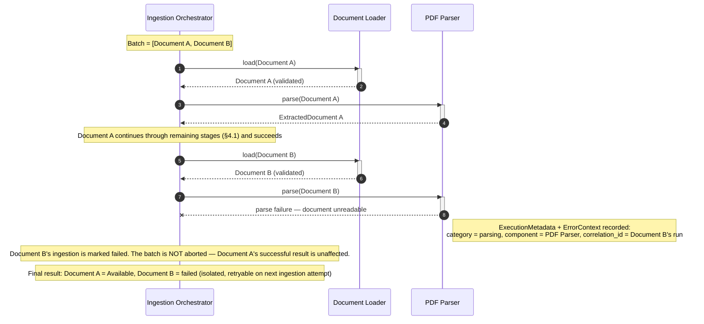
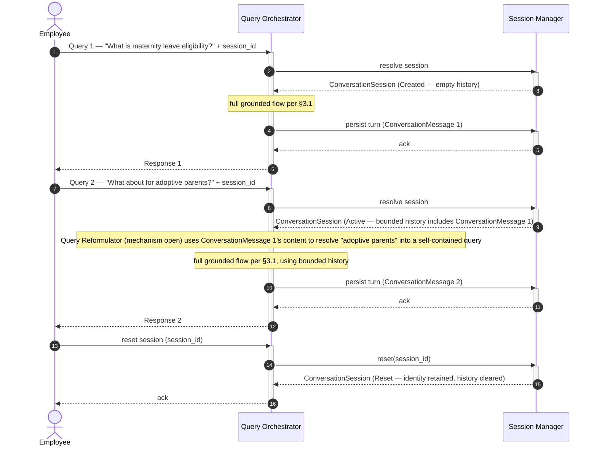
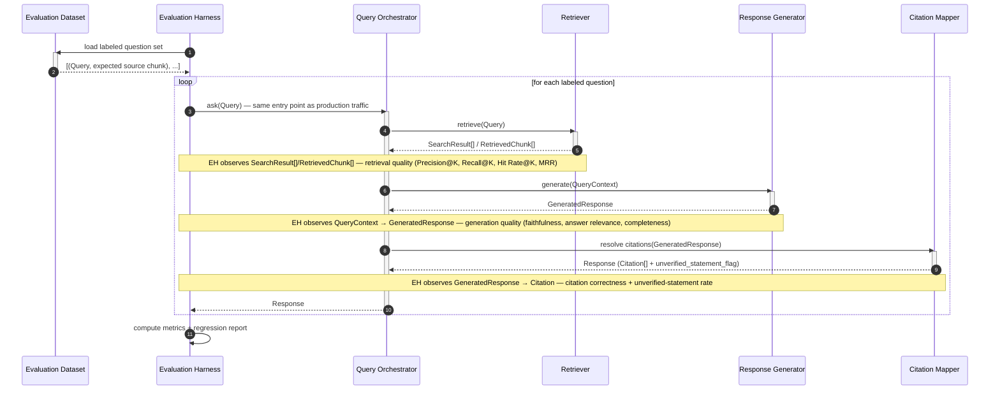

# Sequence Diagrams Specification

## Enterprise HR Policy Assistant — Runtime Collaboration Diagrams

| Field | Value |
|---|---|
| Document Type | Sequence Diagrams Specification |
| Project Name | Enterprise HR Policy Assistant |
| Version | 1.1 |
| Status | Revised — Final Review Before testing.md |
| Upstream Documents | [requirements.md](./requirements.md) (SRS v1.0), [rag_design.md](./rag_design.md) (v1.1), [architecture.md](./architecture.md) (SAD v1.2), [interfaces.md](./interfaces.md) (v1.1), [domain_models.md](./domain_models.md) (v1.3) |
| Downstream Documents (not yet created) | `testing.md`, `deployment.md`, `tasks.md` |
| Prepared By | Principal AI Solution Architect |
| Date | 2026-07-29 |

---

## 1. Document Control

`sequence_diagrams.md` is the sixth document in the Specification-Driven Development (SDD) chain:

```
requirements.md → rag_design.md → architecture.md → interfaces.md → domain_models.md →
sequence_diagrams.md → testing.md → deployment.md → tasks.md → implementation
```

This document is where the static contracts in `interfaces.md` and the static object definitions in `domain_models.md` become **runtime behavior**: who calls whom, in what order, and which domain model exists at each point in time. It introduces no new components, no new domain models, and no new architectural decisions — every participant, every domain object, and every boundary rule shown below already exists in one of the five upstream documents, cited inline throughout.

**What this document adds that the upstream documents could not:** `rag_design.md` and `architecture.md` describe component responsibilities and data flow in prose and static diagrams; `interfaces.md` defines contracts in isolation; `domain_models.md` defines object meaning independent of time. None of them show a complete, ordered, timed collaboration — which is what an engineer actually needs to implement a stage correctly (what has already happened by the time my stage is called, and what happens after I return), and what an interviewer expects when asked to trace a request end to end. That is this document's sole job.

**Diagram notation:** every sequence diagram below is written as a [Mermaid](https://mermaid.js.org/) `sequenceDiagram` code block — plain text, renders natively in this and most other markdown viewers, requires no external tooling, and is precise enough to remove ambiguity about call order and return values without becoming implementation code.

| Version | Date | Description |
|---|---|---|
| 1.0 | 2026-07-29 | Initial Sequence Diagrams Specification |
| 1.1 | 2026-07-29 | Final review pass before `testing.md`. **Correction:** §3.2 and §3.3's compressed Provider Interface → External Infrastructure arrows literally depicted a Provider Interface calling External Infrastructure directly, which is not a permitted boundary crossing — added inline notes at both points making clear the Provider Implementation layer is omitted for brevity, not bypassed. Strengthened §2.2's boundary wording with an explicit list of vendor object types a Pipeline Stage must never see. Added streaming-independence notes to §3.1/§3.3 (Response Generator interactions assume the MVP blocking reference path only; `GeneratedResponse` is transport-independent). Added an embedding-model-version-mismatch detection note to §3.1 and a re-ingestion replace-semantics note to §4.1, closing two edge-case gaps identified during review; reviewed two further candidate gaps (configuration validation failure, conversation reset) and confirmed no new diagram is needed for either, with reasoning documented. Redrew §5.1 to show explicit two-attempt retry visibility (ownership only — no retry count specified). Added five new sections: Message Flow & Orchestrator Ownership Validation, Domain Model Lifetime, Failure Semantics (Business Outcome vs. Technical Failure), Performance Observation Points, and Edge Case Coverage Review. Extended the Runtime Invariants Validation table with an explicit `ExecutionMetadata`-never-becomes-a-business-model check. Added a Sequence Test Mapping section as the intended starting point for `testing.md`. Renumbered subsequent sections accordingly. |

---

## 2. Sequence Diagram Conventions

### 2.1 Participants

Every diagram in this document draws its participants from this fixed list, using the same short alias every time it appears, so a reader can move between diagrams without re-learning names.

**Actors**

| Full Name | Alias | Appears In |
|---|---|---|
| Employee | `Employee` | §3.1, §3.2, §3.3, §6.1 |
| HR Policy Owner | `HRPO` | §4.1 |
| System Administrator | *(not aliased)* | Not given a dedicated diagram in this version — System Administrator interactions (configuration, document deletion, monitoring) are covered narratively in `architecture.md` §2, §9 and are not part of the seven flows this document was scoped to cover. Flagged here so the omission is deliberate, not an oversight. |

**Orchestration**

| Full Name | Alias |
|---|---|
| Query Orchestrator | `QO` |
| Ingestion Orchestrator | `IO` |

**Pipeline Stages — Ingestion**

| Full Name | Alias |
|---|---|
| Document Loader | `DL` |
| PDF Parser | `PP` |
| Text Preprocessor | `TP` |
| Semantic Chunker | `SC` |
| Metadata Extractor | `ME` |
| Embedding Generator | `EG` |
| Vector Indexer | `VI` |

**Pipeline Stages — Query**

| Full Name | Alias | Status Note |
|---|---|---|
| Session Manager | `SM` | — |
| Query Analyzer | `QA` | **Provisional** — architectural extension, not an approved FR (`architecture.md` §16; `domain_models.md` Open Decision 1). Marked in every diagram it appears in. |
| Query Reformulator | `QR` | **Mechanism open** — model shape is fixed, implementation mechanism is not (`interfaces.md` 4.10; `domain_models.md` Open Decision 2). Marked in every diagram it appears in. |
| Retriever | `RET` | — |
| Context Builder | `CB` | — |
| Prompt Assembler | `PA` | — |
| Response Generator | `RG` | — |
| Citation Mapper | `CM` | — |
| Not Found Path | `NFP` | Stage-equivalent responsibility, not a numbered `interfaces.md` stage — see `rag_design.md` §5.10; `domain_models.md` §9. |

**Providers**

| Full Name | Alias |
|---|---|
| Embedding Provider Interface | `EPI` |
| Vector Store Provider Interface | `VSPI` |
| LLM Provider Interface | `LPI` |

**Infrastructure**

| Full Name | Alias |
|---|---|
| Vector Database | `VDB` |
| Document Store | `DS` |
| LLM Service | `LLMSvc` |
| Embedding Service | `ES` |

### 2.2 Boundary Rules Every Diagram Obeys

These are not per-diagram notes — they are invariant across this entire document, per `architecture.md` §3.0 and `interfaces.md` §2.1:

```
Application Layer
        ↓
Orchestration Layer
        ↓
Pipeline Stages
        ↓
Domain Models
        ↓
Provider Interfaces
        ↓
Provider Implementations
        ↓
External Infrastructure
```

- **No Pipeline Stage ever calls a Provider Implementation or an External Infrastructure participant directly.** Every call from a stage to the outside world passes through a Provider Interface first.
- **A vendor SDK is only ever visible between a Provider Implementation and its External Infrastructure participant.** No arrow in any diagram below crosses from a Pipeline Stage, an Orchestrator, or a Provider Interface directly into `VDB`, `LLMSvc`, or `ES`.
- **Pipeline Stages never see, and no diagram in this document ever shows a Pipeline Stage receiving:**
  - An OpenAI (or any LLM vendor's) native response object
  - A Chroma or Pinecone (or any vector database vendor's) native result object
  - A PDF parser library's native document/page object
  - An embedding library's native vector/response type

  **Only Provider Interfaces exchange domain models with Pipeline Stages.** Every arrow that terminates at a Pipeline Stage in this document carries a named domain model (`Embedding`, `SearchResult[]`, `GeneratedResponse`, etc.) or a plain scalar (a category label, an identifier) — never a vendor-shaped object. This is checked explicitly, diagram by diagram, in §8 below.
- **§3.1 and §4.1 show the full Provider Interface → Provider Implementation → External Infrastructure chain explicitly**, once each, for the query path and the ingestion path respectively, to make this boundary concrete. §3.2, §3.3, §6.1, and §7.1 compress a Provider Interface's call to its External Infrastructure into a single labeled arrow where the provider boundary is not the point of that particular diagram — **this is a diagram-brevity compression, not a permitted architectural shortcut**; every compressed arrow carries an inline note pointing back to the full expansion, so it cannot be misread as showing a Provider Interface talking to External Infrastructure directly.
- **Orchestrators only sequence.** No diagram below has an Orchestrator (`QO`, `IO`) compute a business decision — every branch an Orchestrator takes is based on a value a stage already reported back to it (an empty `SearchResult[]`, a query category, a finish reason), never a decision the Orchestrator makes itself (`interfaces.md` §3, "Orchestrator Responsibility Boundary"; `domain_models.md` Runtime Invariant 5). This is checked explicitly, diagram by diagram, in §8 below.
- **Domain models are called out by name at the point they are created or transformed**, using `Note` annotations, so their movement through the system is traceable independent of the call/return arrows around them.

---

## 3. Query Processing Sequence Diagrams

### 3.1 Successful Grounded Answer Flow

The reference path: every stage runs, retrieval finds usable evidence, the LLM produces a citable answer, and every citation resolves. This is also the diagram that establishes the full Provider Interface → Provider Implementation → External Infrastructure expansion referenced throughout the rest of this document.

```mermaid
sequenceDiagram
    autonumber
    actor Employee
    participant QO as Query Orchestrator
    participant SM as Session Manager
    participant QA as Query Analyzer
    participant QR as Query Reformulator
    participant RET as Retriever
    participant EPI as Embedding Provider Interface
    participant EImpl as Embedding Provider Impl.
    participant ES as Embedding Service
    participant VSPI as Vector Store Provider Interface
    participant VImpl as Vector Store Provider Impl.
    participant VDB as Vector Database
    participant CB as Context Builder
    participant PA as Prompt Assembler
    participant RG as Response Generator
    participant LPI as LLM Provider Interface
    participant LImpl as LLM Provider Impl.
    participant LLMSvc as LLM Service
    participant CM as Citation Mapper

    Employee->>QO: submit question + session_id
    activate QO

    QO->>SM: resolve session
    activate SM
    SM-->>QO: ConversationSession
    deactivate SM
    Note right of SM: ConversationSession created/loaded (domain_models.md §10)

    QO->>QA: classify(ConversationSession)
    activate QA
    Note right of QA: PROVISIONAL — architecture.md §16; no approved FR yet
    QA-->>QO: category = policy_query
    deactivate QA

    QO->>QR: reformulate(Query, ConversationSession)
    activate QR
    Note right of QR: mechanism OPEN — interfaces.md 4.10; domain_models.md Open Decision 2
    QR-->>QO: Query (resolved form — same object, not a new one, per domain_models.md §6)
    deactivate QR

    QO->>RET: retrieve(Query)
    activate RET
    RET->>EPI: embed(query text)
    activate EPI
    EPI->>EImpl: dispatch
    activate EImpl
    EImpl->>ES: vendor-specific embedding request
    activate ES
    ES-->>EImpl: vendor-native vector
    deactivate ES
    EImpl-->>EPI: Embedding (translated to domain shape)
    deactivate EImpl
    EPI-->>RET: Embedding
    deactivate EPI
    RET->>VSPI: search(Embedding, top-K, filters)
    activate VSPI
    Note right of VSPI: model/version compatibility check happens HERE — a query Embedding produced by a different model/version than the indexed chunks is detected and reported, never silently compared (rag_design.md §3.1, Risk R-003)
    VSPI->>VImpl: dispatch
    activate VImpl
    VImpl->>VDB: vendor-specific similarity search
    activate VDB
    VDB-->>VImpl: vendor-native result set
    deactivate VDB
    VImpl-->>VSPI: SearchResult[] (translated to domain shape)
    deactivate VImpl
    VSPI-->>RET: SearchResult[]
    deactivate VSPI
    Note right of RET: SearchResult[] — raw candidates (domain_models.md §7)
    RET-->>QO: SearchResult[]
    deactivate RET

    QO->>CB: build context(SearchResult[], ConversationSession)
    activate CB
    Note right of CB: selects RetrievedChunk[] from SearchResult[] — candidate vs. evidence
    CB-->>QO: QueryContext
    deactivate CB
    Note right of CB: QueryContext — assembled evidence bundle (domain_models.md §6)

    QO->>PA: assemble prompt(QueryContext)
    activate PA
    PA-->>QO: rendered prompt
    deactivate PA
    Note right of PA: rendered prompt is a processing artifact — NOT a domain model (domain_models.md §16)

    QO->>RG: generate(rendered prompt)
    activate RG
    Note over RG: MVP reference path shown here is BLOCKING generation. GeneratedResponse represents the completed domain object regardless of transport — streaming is transport behavior at the LPI boundary and is intentionally excluded from this diagram (domain_models.md §8; Open Decision 5)
    RG->>LPI: generate(prompt payload)
    activate LPI
    Note over LPI,LLMSvc: the LLM receives the rendered prompt text ONLY — never QueryContext or any domain object directly
    LPI->>LImpl: dispatch
    activate LImpl
    LImpl->>LLMSvc: vendor-specific completion request
    activate LLMSvc
    LLMSvc-->>LImpl: vendor-native completion
    deactivate LLMSvc
    LImpl-->>LPI: GeneratedResponse (translated to domain shape)
    deactivate LImpl
    LPI-->>RG: GeneratedResponse
    deactivate LPI
    RG-->>QO: GeneratedResponse
    deactivate RG
    Note right of RG: GeneratedResponse — completed, citable content (domain_models.md §8)

    QO->>CM: resolve citations(GeneratedResponse, QueryContext)
    activate CM
    Note right of CM: resolves CitationReference against QueryContext's carried metadata ONLY — no call back to VSPI or VDB; no runtime citation discovery
    CM-->>QO: Response (grounded state)
    deactivate CM

    QO->>SM: persist turn (ConversationMessage)
    activate SM
    SM-->>QO: ack
    deactivate SM

    QO-->>Employee: Response (answer text + Citation[])
    deactivate QO
```

**What this diagram demonstrates:**
- Orchestration only controls order — `QO` never computes anything itself; it relays each stage's output as the next stage's input.
- Every stage creates or consumes a named domain model, never an untyped blob.
- The LLM receives the rendered prompt text only — `QueryContext` and every other domain object stop at the Prompt Assembler.
- Citation Mapper resolves references using the metadata already carried in `QueryContext` — there is no arrow from `CM` back to `VSPI` or `VDB`; citations are never discovered at citation-resolution time, only at retrieval time.
- The full Provider Interface → Provider Implementation → External Infrastructure chain is visible for both the Embedding and LLM calls, and no Pipeline Stage or Orchestrator ever touches `EImpl`, `LImpl`, `ES`, or `LLMSvc` directly.
- Embedding model/version compatibility is checked at the Vector Store Provider Interface boundary, not left implicit.

**Requirement traceability:**

| Diagram Segment | Requirement(s) |
|---|---|
| `RET` → `EPI`/`VSPI` → `SearchResult[]` | FR-801–806 (Semantic Retrieval) |
| `CB` → `QueryContext` | FR-901–905 (Context Construction) |
| `PA` → rendered prompt | FR-1001–1005 (Prompt Generation) |
| `RG` → `LPI` → `GeneratedResponse` | FR-1101–1106 (LLM Response Generation) |
| `CM` → `Response` | FR-1201–1205 (Citation Generation) |
| Full diagram | NFR-MOD-001/002 (each stage independently callable, testable, replaceable) |
| Provider Interface/Implementation split | NFR-EXT-001–003 (provider swap-out without touching pipeline logic) |

### 3.2 Empty Retrieval / No Relevant Information Flow

Purpose: demonstrate hallucination prevention. When retrieval finds nothing usable, the system must never proceed to generation.

```mermaid
sequenceDiagram
    autonumber
    actor Employee
    participant QO as Query Orchestrator
    participant RET as Retriever
    participant VSPI as Vector Store Provider Interface
    participant VDB as Vector Database
    participant NFP as Not Found Path

    Employee->>QO: submit question + session_id
    activate QO
    Note over QO: Session Manager → Query Analyzer → Query Reformulator routing occurs exactly as in §3.1, omitted here for focus

    QO->>RET: retrieve(Query)
    activate RET
    RET->>VSPI: search(Embedding, top-K, threshold)
    activate VSPI
    VSPI->>VDB: vendor-specific similarity search
    Note right of VSPI: Provider Implementation layer omitted here for brevity — see §3.1 for the full VSPI → Provider Impl. → VDB expansion; VSPI never calls VDB directly in the real system
    VDB-->>VSPI: vendor-native result set (below threshold, or none)
    VSPI-->>RET: SearchResult[] = []
    deactivate VSPI
    RET-->>QO: SearchResult[] = [] — a valid outcome, not an error
    deactivate RET

    rect rgb(255, 235, 235)
        Note over QO: NOT executed: Context Builder, Prompt Assembler, Response Generator, LLM Provider Interface, Citation Mapper
    end

    QO->>NFP: build declined response(no evidence)
    activate NFP
    NFP-->>QO: Response (declined state — Citation[] = [], unverified_statement_flag = false)
    deactivate NFP

    QO-->>Employee: declined Response ("no relevant policy information found")
    deactivate QO
```

**Empty retrieval is a valid business outcome, NOT a system error.** No `ErrorContext` is ever created on this path, and the response returned to the Employee is a well-formed, successful `Response` — just one with no answer content and no citations. Neither `QueryContext` nor `GeneratedResponse` is ever constructed on this path (`domain_models.md` Runtime Invariant 2).

**Requirement traceability:** FR-805 (no-relevant-content fallback), FR-1106 (no fabrication on insufficient context), `domain_models.md` Runtime Invariant 1 (declined `Response` may exist without `QueryContext`).

### 3.3 LLM Grounding Refusal Flow

The third and least obvious declined-path trigger: retrieval *did* find evidence, and the LLM *was* called — but the model itself determined the evidence was insufficient to answer, so the answer is still declined rather than fabricated.

```mermaid
sequenceDiagram
    autonumber
    actor Employee
    participant QO as Query Orchestrator
    participant RET as Retriever
    participant CB as Context Builder
    participant PA as Prompt Assembler
    participant RG as Response Generator
    participant LPI as LLM Provider Interface
    participant LLMSvc as LLM Service
    participant NFP as Not Found Path
    participant CM as Citation Mapper

    Employee->>QO: submit question + session_id
    activate QO
    Note over QO: Session Manager → Query Analyzer → Query Reformulator routing occurs exactly as in §3.1, omitted here for focus

    QO->>RET: retrieve(Query)
    activate RET
    RET-->>QO: SearchResult[] (non-empty)
    deactivate RET

    QO->>CB: build context(SearchResult[])
    activate CB
    CB-->>QO: QueryContext
    deactivate CB
    Note right of CB: QueryContext DOES exist for this trigger case

    QO->>PA: assemble prompt(QueryContext)
    activate PA
    PA-->>QO: rendered prompt
    deactivate PA

    QO->>RG: generate(rendered prompt)
    activate RG
    Note over RG: same MVP blocking reference path and transport-independence note as §3.1 apply here — omitted for brevity
    RG->>LPI: generate(prompt payload)
    activate LPI
    LPI->>LLMSvc: vendor-specific completion request
    Note right of LPI: Provider Implementation layer omitted here for brevity — see §3.1 for the full LPI → Provider Impl. → LLMSvc expansion; LPI never calls LLMSvc directly in the real system
    LLMSvc-->>LPI: completion — finish_reason = insufficient_context
    LPI-->>RG: GeneratedResponse (finish_reason = declined)
    deactivate LPI
    RG-->>QO: GeneratedResponse
    deactivate RG
    Note right of RG: GeneratedResponse DOES exist — the LLM was actually called and it responded

    rect rgb(255, 235, 235)
        Note over QO,CM: Citation Mapper is bypassed — the GeneratedResponse is discarded, not resolved into citations
    end

    QO->>NFP: build declined response(insufficient grounding)
    activate NFP
    NFP-->>QO: Response (declined state — Citation[] = [])
    deactivate NFP

    QO-->>Employee: declined Response
    deactivate QO
```

**This diagram exists specifically to show three facts together:** `QueryContext` exists, the LLM was actually called, and Citation Mapper is still bypassed — the presence of a `GeneratedResponse` does not, by itself, entitle the request to a cited answer. No unsupported answer is ever returned; a `GeneratedResponse` with a declining finish reason is discarded in favor of the same declined `Response` shape used in §3.2, never surfaced as-is (`domain_models.md` §9, "Response State Clarification," trigger case 3; Runtime Invariant 1).

---

## 4. Document Ingestion Sequence Diagrams

### 4.1 PDF Ingestion Success Flow

```mermaid
sequenceDiagram
    autonumber
    actor HRPO as HR Policy Owner
    participant IO as Ingestion Orchestrator
    participant DL as Document Loader
    participant PP as PDF Parser
    participant TP as Text Preprocessor
    participant DS as Document Store
    participant SC as Semantic Chunker
    participant ME as Metadata Extractor
    participant EG as Embedding Generator
    participant EPI as Embedding Provider Interface
    participant EImpl as Embedding Provider Impl.
    participant ES as Embedding Service
    participant VI as Vector Indexer
    participant VSPI as Vector Store Provider Interface
    participant VImpl as Vector Store Provider Impl.
    participant VDB as Vector Database

    HRPO->>IO: supply source PDF
    activate IO

    IO->>DL: load(raw file)
    activate DL
    DL-->>IO: Document (validated, ID + provenance)
    deactivate DL
    Note right of DL: Document created (domain_models.md §3)

    IO->>PP: parse(Document)
    activate PP
    PP-->>IO: ExtractedDocument (raw facet)
    deactivate PP

    IO->>TP: preprocess(ExtractedDocument)
    activate TP
    TP-->>IO: ExtractedDocument (normalized facet — same object, per domain_models.md §3 merge)
    deactivate TP
    IO->>DS: persist(ExtractedDocument)
    activate DS
    DS-->>IO: ack
    deactivate DS
    Note right of DS: retained for audit — SRS FR-305

    IO->>SC: chunk(ExtractedDocument)
    activate SC
    SC-->>IO: TextChunk[] (unenriched)
    deactivate SC
    Note right of SC: TextChunk[] created — permanent stored knowledge units (domain_models.md §4)

    IO->>ME: enrich(TextChunk[], DocumentMetadata)
    activate ME
    ME-->>IO: TextChunk[] + ChunkMetadata
    deactivate ME
    Note right of ME: ChunkMetadata attached — references DocumentMetadata, does not duplicate it

    IO->>EG: embed(TextChunk[])
    activate EG
    EG->>EPI: embed(chunk text, batch)
    activate EPI
    EPI->>EImpl: dispatch
    activate EImpl
    EImpl->>ES: vendor-specific embedding request (batch)
    activate ES
    ES-->>EImpl: vendor-native vectors
    deactivate ES
    EImpl-->>EPI: Embedding[] (translated to domain shape)
    deactivate EImpl
    EPI-->>EG: Embedding[]
    deactivate EPI
    EG-->>IO: TextChunk[] + Embedding
    deactivate EG
    Note right of EG: Embedding created — model/version recorded (domain_models.md §5)

    IO->>VI: index(TextChunk[] + Embedding, mode=upsert)
    activate VI
    Note right of VI: upsert is replace-semantics keyed on Document identity — a re-ingestion of an already-indexed Document atomically replaces its prior version's chunks here; Document's identity is stable across versions, only DocumentMetadata.version increments (domain_models.md §3, SRS FR-105/FR-702). This is the SAME sequence as first-time ingestion — no separate diagram is required.
    VI->>VSPI: upsert(chunks)
    activate VSPI
    VSPI->>VImpl: dispatch
    activate VImpl
    VImpl->>VDB: vendor-specific upsert
    activate VDB
    VDB-->>VImpl: ack
    deactivate VDB
    VImpl-->>VSPI: success/failure per chunk (translated)
    deactivate VImpl
    VSPI-->>VI: success/failure per chunk
    deactivate VSPI
    VI-->>IO: ingestion result summary
    deactivate VI

    IO-->>HRPO: ingestion result (Document now Available)
    deactivate IO
```

**Domain objects shown:** `Document`, `ExtractedDocument`, `TextChunk`, `ChunkMetadata`, `Embedding` — every object created moves exactly one step at a time from one stage's output to the next stage's input, matching `domain_models.md` §12's Ingestion Relationship canonical chain (`Document → ExtractedDocument → TextChunk → Embedding`).

**Requirement traceability:** FR-101–109 (Document Ingestion), FR-201–206 (PDF Parsing), FR-301–305 (Text Preprocessing), FR-401–407 (Semantic Chunking), FR-501–505 (Metadata Extraction), FR-601–606 (Embedding Generation), FR-701–705 (Vector Database Storage).

### 4.2 Ingestion Failure Isolation Flow

One document in a batch fails; the batch is not aborted.



**Requirement traceability:** FR-1404 (batch failure isolation), NFR-REL-005 (one document's failure never corrupts previously indexed documents).

---

## 5. Provider Failure Sequence

### 5.1 External Dependency Failure Handling

The generic pattern every Provider Interface follows — shown once, abstractly, because it is identical regardless of which of the three providers (Embedding, Vector Store, LLM) is involved. Redrawn in this revision to show retry as an explicit two-attempt sequence, with ownership — not count — as the point being made.

```mermaid
sequenceDiagram
    autonumber
    participant PS as Pipeline Stage
    participant PI as Provider Interface
    participant IMPL as Provider Implementation
    participant EXT as External Service
    participant ORC as Orchestrator

    PS->>PI: call(domain-shaped request)
    activate PI
    PI->>IMPL: dispatch — Attempt 1
    activate IMPL
    IMPL->>EXT: vendor-specific request
    activate EXT
    EXT--xIMPL: vendor-specific failure (timeout / 5xx / rate-limit)
    deactivate EXT
    Note right of IMPL: vendor-specific exception caught HERE — never re-thrown as-is
    IMPL-->>PI: normalized failure (recoverable category)
    deactivate IMPL
    PI-->>PS: normalized failure (recoverable category)
    deactivate PI
    Note over PS: Pipeline Stage never sees a vendor-specific exception type — only the normalized category (interfaces.md §5, §7)

    PS-->>ORC: propagate failure (ExecutionMetadata + ErrorContext)
    activate ORC
    Note over ORC: retry POLICY ownership: the Orchestrator decides whether this failure category is eligible for retry at all. The Provider Implementation owns actually re-attempting the call. Configuration owns how many times (not shown — no count is specified by this diagram).
    ORC->>PI: retry — Attempt 2
    deactivate ORC
    activate PI
    PI->>IMPL: dispatch — Attempt 2
    activate IMPL
    IMPL->>EXT: vendor-specific request
    activate EXT
    alt Attempt 2 succeeds
        EXT-->>IMPL: vendor-native response
        deactivate EXT
        IMPL-->>PI: domain-shaped result (translated)
        deactivate IMPL
        PI-->>PS: success
        deactivate PI
    else Attempt 2 also fails
        EXT--xIMPL: vendor-specific failure
        deactivate EXT
        IMPL-->>PI: normalized failure category
        deactivate IMPL
        PI-->>PS: normalized failure
        deactivate PI
        PS-->>ORC: propagate failure
        activate ORC
        Note over ORC: retry budget exhausted (owned by configuration, not this diagram) → treat as non-recoverable → fail this unit of work only, do not crash the surrounding batch or session
        deactivate ORC
    end
```

**Pipeline stages never handle vendor-specific exceptions.** The normalization boundary sits inside the Provider Implementation, one layer below the Provider Interface — by the time a failure reaches a Pipeline Stage or an Orchestrator, it is already one of five normalized categories, never a vendor SDK's native exception type.

**Retry ownership, stated explicitly (no count specified, per design):** the *Orchestrator* decides whether a normalized failure category is retry-eligible; the *Provider Implementation* is where a retry attempt is physically re-issued; *configuration* (not this document) owns the maximum attempt count and backoff timing. This diagram shows two attempts to make the pattern visible, not because two is the configured limit.

**Requirement traceability:** `interfaces.md` §7 (Error Contracts), NFR-EXT-001–003 (provider swap without touching pipeline logic — a swapped provider's different failure modes never reach the stage), NFR-REL-002/003 (graceful degradation, retry with backoff).

---

## 6. Conversation Management Sequence

### 6.1 Multi-turn Conversation



**Session isolation:** each `session_id` resolves to exactly one `ConversationSession`; nothing in this diagram, or in `Session Manager`'s contract (`interfaces.md` 4.8), allows one session's history to leak into another's.

**Bounded history:** `ConversationSession.messages` is bounded per SRS FR-1303 — the diagram's second turn shows only the immediately preceding message being used for reformulation, not an unbounded conversation log.

**Reset/expiration concept:** shown as the third interaction — a session's `Created → Active → Reset/Expired` lifecycle (`domain_models.md` §10) is a business-meaningful state transition, not an implementation detail. This is the only conversation-reset behavior in scope for this document; no additional diagram is needed (§12).

**This document does not decide storage technology.** `Session Manager` is drawn as a single opaque participant throughout — no Redis, database, or cache appears in this diagram, deliberately, because the backing store is an open ADR (`architecture.md` ADR-007) that this document must not prejudge.

---

## 7. Evaluation Sequence Diagram

### 7.1 Offline Evaluation Flow



**Evaluation observes production pipeline. It does not create alternate logic.** The Evaluation Harness calls the same `Query Orchestrator` entry point any other caller uses (`architecture.md` §5; `rag_design.md` §9) — there is no separate "evaluation implementation" of retrieval, generation, or citation resolution anywhere in this system. Where isolation is needed for a specific metric, the Evaluation Harness substitutes a stubbed Provider Interface underneath (`interfaces.md` §9), never a different Pipeline Stage.

**Metrics computed** (per `rag_design.md` §9.2–9.3, `domain_models.md` §17 "Evaluation Traceability"): retrieval precision/recall (Precision@K, Recall@K, Hit Rate@K, MRR), citation accuracy, unverified-statement rate, latency, token usage. None of these is a stored domain model — each is a value computed at evaluation time from the existing `Query` → `SearchResult`/`RetrievedChunk` → `QueryContext` → `GeneratedResponse` → `Citation` chain. No `EvaluationResult` domain model is introduced by this document, consistent with `domain_models.md` §17's explicit decision not to add one.

---

## 8. Message Flow & Orchestrator Ownership Validation

Every arrow in every diagram above was reviewed against two questions: *does the sender own the information it is sending, and is the receiver allowed to consume it in this shape?* Separately, every Orchestrator action was checked against a fixed allowed/forbidden list. Both checks are recorded here, including the one correction found.

### 8.1 Message Flow Ownership

| Check | Result |
|---|---|
| Does any Pipeline Stage ever receive a vendor-native object (e.g., a raw vector-database result, a raw LLM completion object) instead of a domain model? | **No**, in the fully-expanded diagrams (§3.1, §4.1, §5.1) — translation happens strictly inside the Provider Implementation, before the Provider Interface returns to the calling stage. |
| Does any *compressed* diagram (§3.2, §3.3) visually suggest a Provider Interface calling External Infrastructure directly? | **Yes — found and corrected.** §3.2's `VSPI->>VDB` arrow and §3.3's `LPI->>LLMSvc` arrow are diagram-brevity compressions of the same expansion shown in full in §3.1, but as originally drawn they were indistinguishable from a real boundary violation. **Correction applied:** both arrows now carry an inline note stating the Provider Implementation layer is omitted for brevity and pointing to §3.1 for the real expansion (see §2.2). |
| Does `Response Generator` ever receive anything other than `GeneratedResponse` from `LLM Provider Interface`? | No — confirmed in §3.1 and §3.3; `RG` only ever sees `GeneratedResponse`, never an LLM vendor's native response object. |
| Does `Retriever` ever receive anything other than `SearchResult[]` from `Vector Store Provider Interface`? | No — confirmed in §3.1, §3.2; `RET` only ever sees `SearchResult[]`, never a vector database's native result object. |
| Does `Citation Mapper` ever query `Vector Store Provider Interface` or `Vector Database` directly to resolve a citation? | No — confirmed in §3.1; citation resolution uses only the metadata already carried in `QueryContext`. |

### 8.2 Orchestrator Control Validation

Checked against the allowed/forbidden list in `interfaces.md` §3 and `domain_models.md` Runtime Invariant 5:

| Orchestrators are allowed to... | Confirmed in |
|---|---|
| Invoke stages | Every diagram — `QO`/`IO` issue every call |
| Propagate outcomes | §3.1–§3.3 (each stage's result flows to the next stage or to the Employee unchanged); §5.1 (`PS-->>ORC: propagate failure`) |
| Coordinate retries | §5.1 — `ORC` decides retry-eligibility by category, never by inspecting the failure's content |
| Stop execution | §3.2, §3.3 (short-circuit to Not Found Path); §4.2 (isolate one document's failure without aborting the batch) |
| Route success/failure | Every diagram — branching is always on a value a stage already reported (empty `SearchResult[]`, a finish reason, a failure category), never a value the Orchestrator computed |

| Orchestrators must NEVER... | Confirmed absent |
|---|---|
| Transform domain models | No diagram shows `QO`/`IO` modifying a domain object's content — every object passed through an Orchestrator arrives and leaves unchanged. |
| Inspect embeddings | `QO` never touches an `Embedding` directly — it only ever sees `RET`'s already-translated `SearchResult[]` output. |
| Perform ranking | Ranking/threshold/dedup logic is entirely inside `RET` (§3.1) — `QO` receives only the final `SearchResult[]`. |
| Build prompts | Prompt assembly is entirely inside `PA` (§3.1) — `QO` receives only the finished rendered prompt (which it does not even inspect, only relays to `RG`). |
| Interpret citations | Citation resolution is entirely inside `CM` (§3.1) — `QO` receives the finished `Response`. The one case where `QO` invokes a *different* component (the Not Found Path, §3.2/§3.3) is itself evidence of this rule holding: `QO` does not interpret the declined outcome's meaning, it delegates that construction to `NFP`. |

**No further corrections were required beyond §8.1's compressed-arrow fix.**

---

## 9. Domain Model Lifetime

For the domain models most central to request-time behavior, this table records where each one's lifetime begins and ends *as observed in the diagrams above*. Full static definitions (including the remaining models not repeated here) are in `domain_models.md` §13–14; this table adds the runtime dimension those static tables do not.

| Domain Model | Created By | Consumed By | Discarded/Superseded By | Persisted? | Temporary? |
|---|---|---|---|---|---|
| `Query` | Session Manager / Query Reformulator (§3.1) | Query Analyzer, Retriever, Prompt Assembler, Context Builder (§3.1) | Folded into a `ConversationMessage` once its turn completes (§6.1) | Yes — as part of `ConversationMessage` | In its standalone form, yes — it does not outlive one request |
| `ConversationSession` | Session Manager, on a session's first turn (§6.1) | Query Analyzer, Query Reformulator, Context Builder | Never destroyed within a diagram's scope — transitions to Reset (explicit) or Expired (per configured lifetime), never deleted outright | Yes — backing technology unspecified (Open Decision 3) | No |
| `GeneratedResponse` | Response Generator, only on a completed LLM call (§3.1, §3.3) | Citation Mapper (grounded path, §3.1) — or discarded unresolved by the Not Found Path (§3.3, trigger case 3) | Citation Mapper (resolved into `Response`) or Not Found Path (discarded without resolution) | No — never persisted independently | Yes — exists only within one request |
| `QueryContext` | Context Builder, only when `RetrievedChunk[]` is non-empty (§3.1) | Prompt Assembler | Discarded once the request completes | No (except when retained for evaluation logging, §7.1) | Yes |
| `SearchResult` | Retriever (§3.1) | Context Builder | Discarded once `RetrievedChunk[]` selection completes | No (except evaluation logging, §7.1) | Yes |
| `RetrievedChunk` | Context Builder, from a subset of `SearchResult[]` (§3.1) | Citation Mapper (via `QueryContext`) | Discarded with its containing `QueryContext` | No | Yes |
| `CitationReference` | Implicitly, alongside `GeneratedResponse`'s text (§3.1) | Citation Mapper (internal resolution step only) | Resolved into a `Citation`, or left unresolved (sets `unverified_statement_flag`) — either way, discarded after resolution completes | No | Yes |
| `Citation` | Citation Mapper, by resolving a `CitationReference` (§3.1) | `Response` (attached) | Never destroyed independently — persists exactly as long as its `Response` does | Yes — as part of `Response` | No |
| `ExecutionMetadata` | Every orchestrator, stage, and provider interface call (implicitly present on every arrow in every diagram above) | Logging/observability sink | Not discarded within request scope — retained per logging configuration | Yes — SRS FR-1501–1503 | No |

---

## 10. Failure Semantics — Business Outcome vs. Technical Failure

Every failure path shown across §3–§7 is one of two kinds, and the two must never be conflated (`interfaces.md` §7, "Not Error Conditions"; `domain_models.md` §11).

| Business Outcome — never an `ErrorContext`, always a successful `Response` | Diagram | Technical Failure — always an `ErrorContext`, never silently absorbed | Diagram |
|---|---|---|---|
| No relevant policy found (empty `SearchResult[]`) | §3.2 | Embedding timeout | §5.1 |
| LLM declined due to insufficient grounding | §3.3 | Vector DB unavailable | §5.1 |
| Unsupported question category (Query Analyzer routing — provisional) | §3.1 (Note) | LLM API timeout | §5.1 |
| Unverified statement flag set on an otherwise-successful `Response` | §3.1, §7.1 | PDF parsing failure | §4.2 |
| | | Provider authentication failure | §5.1 — classified `refused`, non-recoverable |
| | | Network interruption | §5.1 — classified `transient`, recoverable |
| | | Embedding model/version mismatch between a query and the index | §3.1 (Note) — detected at `VSPI`, reported rather than silently degrading relevance (Risk R-003) |

**Confirmed for every diagram above:** every Business Outcome row's path terminates in the Not Found Path (§3.2, §3.3) or a flag set on a normal `Response` (§3.1) — none of them ever create or touch `ErrorContext`. Every Technical Failure row's path terminates in §5.1's normalized-failure-and-retry pattern — none of them are ever surfaced to the Employee as if they were an answer.

---

## 11. Performance Observation Points

These are the points at which latency should be measured, marked here as **observability points only** — no implementation (metrics library, dashboard, alerting threshold) is specified. Each point corresponds to an `ExecutionMetadata.processing_duration` value already required by `interfaces.md` §8; this section only identifies *where* those values are meaningful to look at together.

**Query flow** (per §3.1; target: NFR-PERF-001, p95 ≤ 8s end-to-end):

```
Query received (Employee → QO)
    ↓  [observe: session resolution]
Session Manager
    ↓  [observe: routing — Query Analyzer + Query Reformulator combined]
Query Analyzer / Query Reformulator
    ↓  [observe: retrieval — embedding + vector search combined]
Retriever
    ↓  [observe: context assembly]
Context Builder
    ↓  [observe: generation — prompt assembly + LLM call combined]
Prompt Assembler / Response Generator
    ↓  [observe: citation resolution]
Citation Mapper
    ↓
Response returned (QO → Employee)
```

**Ingestion flow** (per §4.1; target: NFR-PERF-004, 50-page PDF ≤ 2 min):

```
Document received (HRPO → IO)
    ↓  [observe: parsing — PDF Parser + Text Preprocessor combined]
PDF Parser / Text Preprocessor
    ↓  [observe: chunking — Semantic Chunker + Metadata Extractor combined]
Semantic Chunker / Metadata Extractor
    ↓  [observe: embedding]
Embedding Generator
    ↓  [observe: indexing]
Vector Indexer
    ↓
Ingestion result returned (IO → HRPO)
```

Each bracketed point is a candidate boundary for a latency measurement in `testing.md`'s eventual performance test suite — this document does not decide instrumentation mechanism, only where a measurement would be meaningful.

---

## 12. Edge Case Coverage Review

Four candidate runtime scenarios were checked against the diagrams above for coverage. Two required a targeted note added to an existing diagram (already applied in §3.1/§4.1 above); two were confirmed already fully covered or explicitly out of scope, with no new diagram added — consistent with this document's "do not add unnecessary diagrams" constraint.

| Candidate Scenario | Finding | Action |
|---|---|---|
| **Duplicate document re-ingestion** | Not previously distinguished from first-time ingestion. | **Note added to §4.1**, not a new diagram — re-ingestion is the *same* sequence, with the Vector Indexer's `upsert` call carrying replace semantics keyed on the stable `Document` identity (SRS FR-105/FR-702). A second full diagram would duplicate §4.1 with no new call ordering to show. |
| **Conversation reset** | Already covered. | No action — §6.1's third interaction shows this explicitly. |
| **Configuration validation failure** | Out of scope for this document. | No action. This is a startup-time concern (SRS FR-1603, "fail fast... before any... traffic is accepted") — it happens before any request-time sequence begins, not during one. It belongs to `deployment.md`, later in the SDD chain, which will cover process startup and boot behavior. None of the seven flow categories this document was scoped to cover (§Objective) are startup sequences. |
| **Embedding model version mismatch** | Not previously shown. | **Note added to §3.1**, not a new diagram — the compatibility check is a single decision point inside the existing `VSPI.search()` call (Risk R-003), not a distinct multi-step flow with its own ordering. Added to §10's Failure Semantics table as a Technical Failure. |

No real gap requiring a new diagram was found. All four candidates are resolved either by an existing diagram, a targeted note, or an explicit scope boundary.

---

## 13. Runtime Invariants Validation

Every invariant `domain_models.md` §19 states must always hold is validated by at least one diagram above, plus one additional ownership-boundary check from `domain_models.md` §11 that is not one of the six numbered invariants but was checked with the same rigor:

| Invariant | Validated By |
|---|---|
| 1. A grounded `Response` requires `QueryContext` + `GeneratedResponse`; a declined `Response`'s requirements depend on which of three trigger paths produced it (`domain_models.md` §19.1) | §3.1 (grounded — both exist); §3.2 (declined — neither exists); §3.3 (declined — both exist, but Citation Mapper is bypassed) |
| 2. `QueryContext` cannot exist without retrieved evidence or an explicit no-context outcome (§19.2) | §3.2 — Context Builder is never invoked when `SearchResult[]` is empty; no `QueryContext` is ever constructed on that path |
| 3. `Citation` cannot be created without `CitationReference` resolution (§19.3) | §3.1 — Citation Mapper's resolution step; §7.1 — citation-accuracy evaluation reads this same resolution outcome |
| 4. Provider failures cannot create a partial `GeneratedResponse` (§19.4) | §5.1 — a failed provider call (either attempt) produces `ErrorContext`, never a `GeneratedResponse`; §3.1/§3.3 show `GeneratedResponse` only ever appearing on a completed call |
| 5. Orchestrators cannot modify domain model meaning (§19.5) | §8.2 above — the full allowed/forbidden checklist; §3.2/§3.3 specifically show the *Not Found Path*, not the Orchestrator, assembling the declined `Response` |
| 6. Domain models cannot contain provider-specific objects (§19.6) | §3.1, §4.1, §5.1 — the Provider Interface → Provider Implementation boundary is drawn explicitly, and no domain-shaped arrow ever crosses it in vendor-native form; §8.1 above confirms this held even in the compressed diagrams once corrected |
| Additional check: `ExecutionMetadata` never becomes a business model (`domain_models.md` §11 ownership boundary, not a numbered invariant) | §4.2, §5.1 — `ExecutionMetadata`/`ErrorContext` appear only in `Note` annotations describing observability records, never as a field on `Response`, `GeneratedResponse`, or `QueryContext`; §9 above's lifetime table keeps it in its own row, never merged into a business model's row |

**No mismatches found.** Every invariant holds across every diagram, and the one correction needed in this revision (§8.1's compressed-arrow fix) was a diagram-clarity issue, not an invariant violation — the underlying call sequence never actually violated the boundary; only its visual presentation risked being misread.

---

## 14. Sequence Test Mapping

The intended starting point for `testing.md`:

| Sequence | Future Test Category |
|---|---|
| Grounded Answer (§3.1) | Integration |
| Empty Retrieval (§3.2) | Integration |
| LLM Decline (§3.3) | Integration |
| Ingestion Success (§4.1) | Integration |
| Failure Isolation (§4.2) | Resilience |
| Provider Failure (§5.1) | Resilience |
| Conversation (§6.1) | Integration |
| Evaluation (§7.1) | Evaluation |

---

## 15. Open Decisions Captured

The following are carried forward from `domain_models.md` §20, unresolved by this document — each is marked in the diagram(s) where it appears, but no diagram above decides it:

1. **Query Analyzer output shape.** Marked *PROVISIONAL* at every appearance (§3.1). Its final field shape depends on formal requirements alignment (`architecture.md` §16), not on anything shown here.
2. **Query Reformulator mechanism.** Marked *mechanism OPEN* at every appearance (§3.1, §6.1). This document shows *that* reformulation happens and *when*, never *how*.
3. **Session storage technology.** Deliberately not shown in §6.1 — `Session Manager` is drawn as one opaque participant regardless of whether the backing store is in-memory or externalized (ADR-007).
4. **Citation resolution matching rules.** §3.1 and §7.1 show *that* Citation Mapper resolves `CitationReference`s against `QueryContext`'s carried metadata, never the precise matching/confidence algorithm used to do so.
5. **Streaming failure semantics.** No diagram in this document shows a streaming call — every LLM interaction shown (§3.1, §3.3) assumes the MVP reference path (blocking generation, per `domain_models.md` §8), now explicitly marked as such in both diagrams. The streaming failure path remains unspecified and is explicitly deferred, per `domain_models.md` Open Decision 5.

---

## 16. Related and Forthcoming Documents

- [requirements.md](./requirements.md) — the source of truth for *what* the system must do.
- [rag_design.md](./rag_design.md) — the source of truth for pipeline-internal design these sequences implement.
- [architecture.md](./architecture.md) — the source of truth for system-level layering and boundary rules (§2.2 above).
- [interfaces.md](./interfaces.md) — the source of truth for every contract these sequences invoke.
- [domain_models.md](./domain_models.md) — the source of truth for every object named in these sequences' `Note` annotations.
- `testing.md` (not yet created) — will turn §14's mapping into concrete test scenarios.
- `deployment.md`, `tasks.md` (not yet created) — later in the SDD chain; out of scope here. `deployment.md` will additionally cover the configuration-validation-failure startup sequence flagged as out of scope in §12.

Where this document and an upstream document disagree, the upstream document governs, per the SDD chain order above.

---

*End of Document.*
